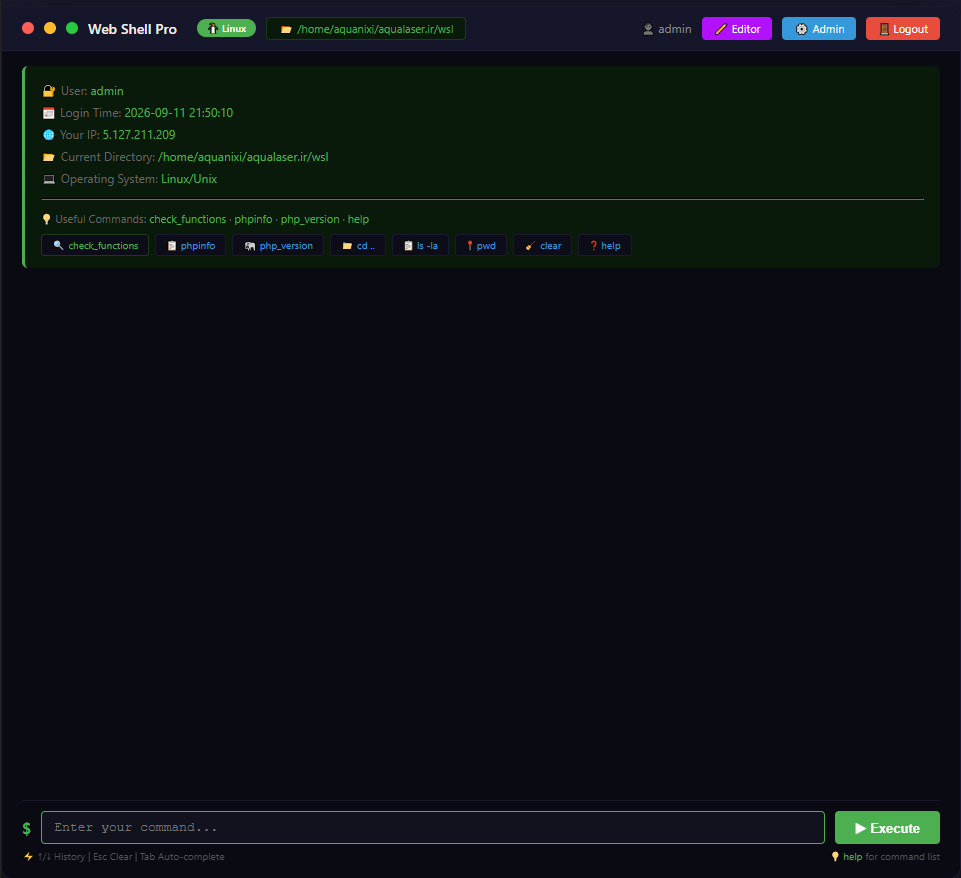
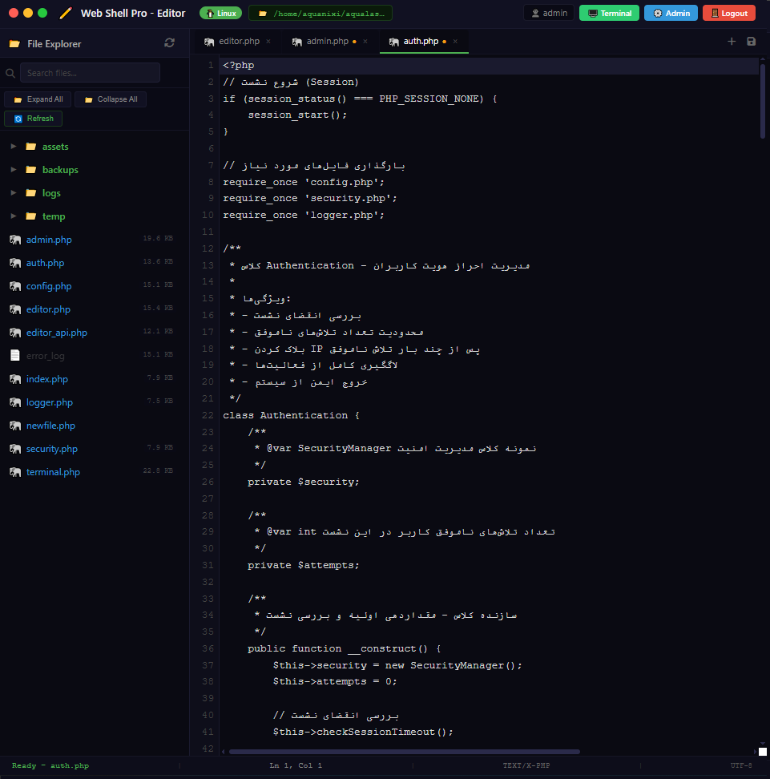
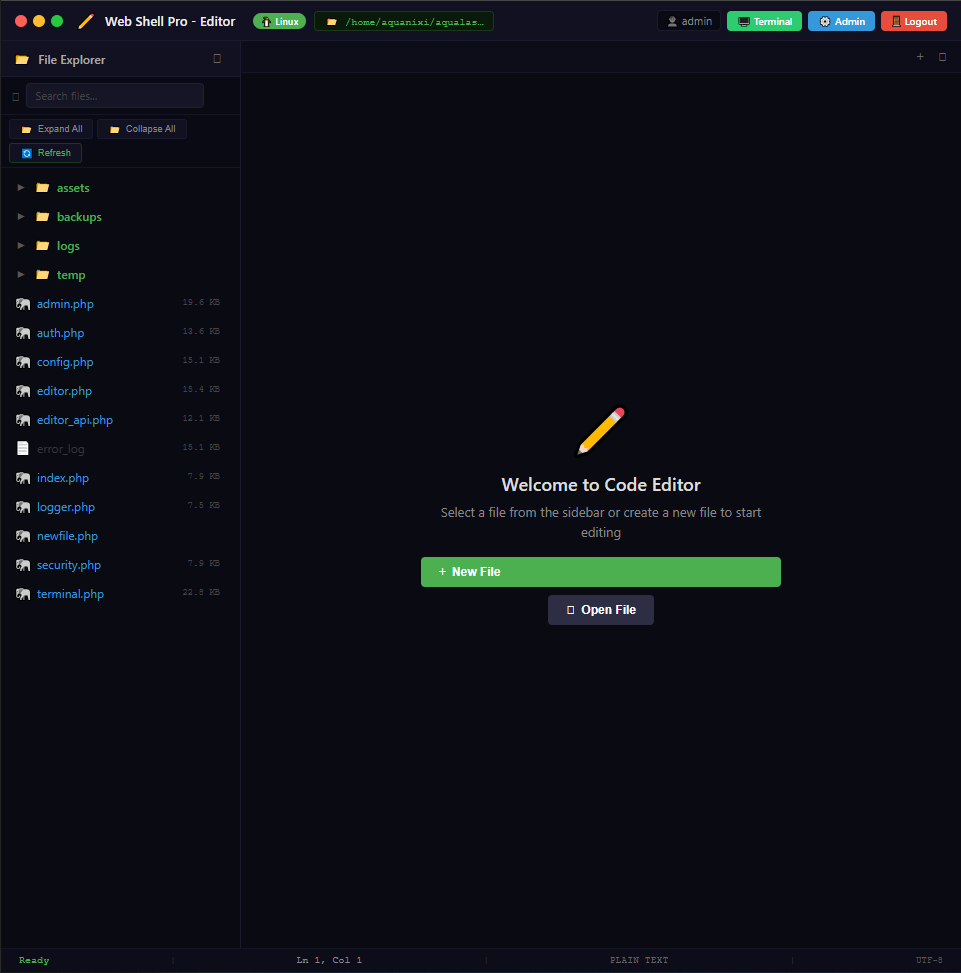
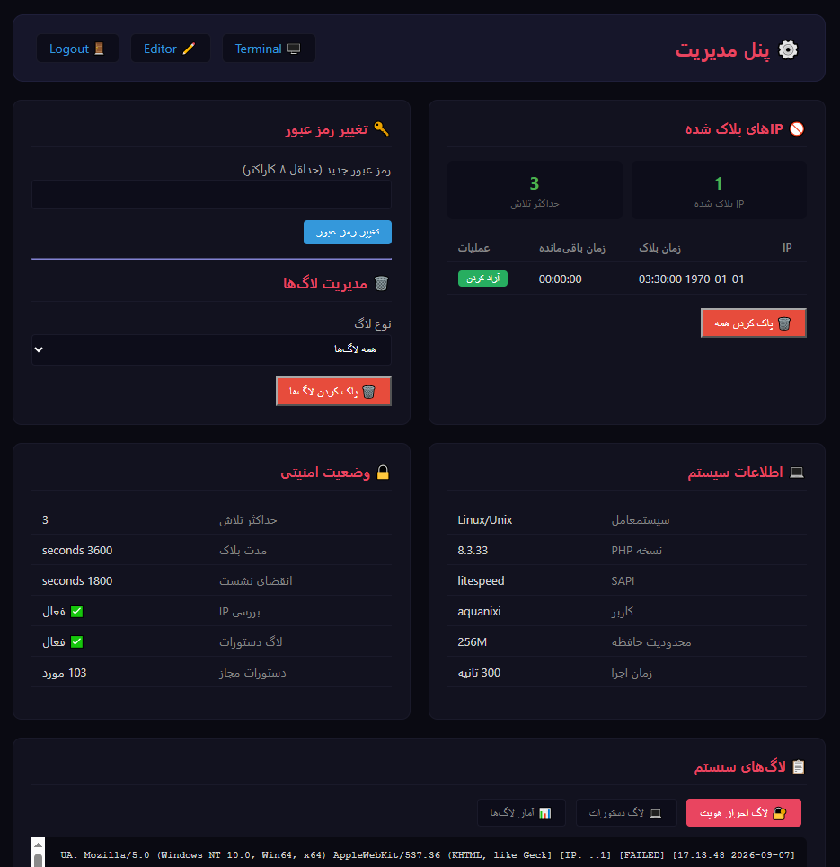
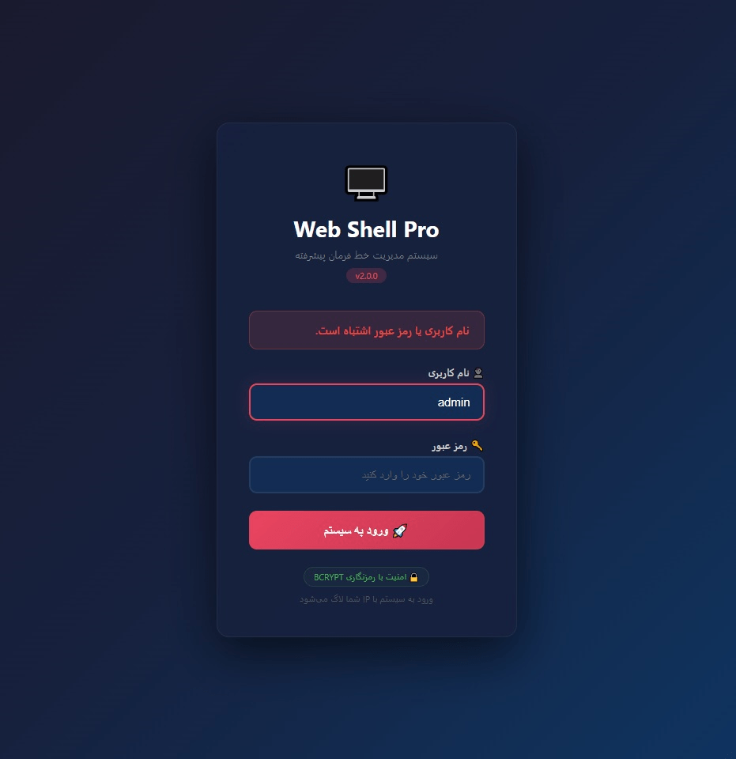

<div align="center">

# 🖥️ Web Shell Pro

### Advanced Web-Based Terminal & Code Editor for cPanel Hosting

[](https://www.php.net/)
[](LICENSE)
[](https://github.com/MeSoheili/web-shell-pro/releases)
[](https://github.com/MeSoheili/web-shell-pro/stargazers)
[](https://github.com/MeSoheili/web-shell-pro/network/members)
[](https://github.com/MeSoheili/web-shell-pro/issues)

**A powerful, secure, and feature-rich web-based terminal and code editor that runs directly on your cPanel hosting — no SSH required!**

[Features](#-features) • [Installation](#-installation) • [Screenshots](#-screenshots) • [Documentation](#-documentation) • [Security](#-security) • [Contributing](#-contributing)

</div>

---

## 📖 Table of Contents

- [About The Project](#-about-the-project)
- [Key Features](#-key-features)
- [Screenshots](#-screenshots)
- [Tech Stack](#-tech-stack)
- [Installation](#-installation)
- [Configuration](#-configuration)
- [Usage](#-usage)
- [Project Structure](#-project-structure)
- [Security](#-security)
- [Performance](#-performance)
- [Roadmap](#-roadmap)
- [FAQ](#-faq)
- [Contributing](#-contributing)
- [License](#-license)
- [Contact](#-contact)
- [Acknowledgments](#-acknowledgments)

---

## 🎯 About The Project

**Web Shell Pro** is a comprehensive, web-based development environment designed specifically for **shared hosting environments** like cPanel where:

- ❌ SSH access is disabled by the hosting provider
- ❌ VSCode Remote-SSH cannot connect
- ❌ FTP is slow and lacks code editing capabilities
- ✅ You still need full control over your files and terminal

This project bridges that gap by providing a **professional-grade IDE and terminal** that runs entirely in your browser — no installation on your local machine, no SSH required.

### 🎯 Who Is This For?

- **Web Developers** managing multiple cPanel-hosted projects
- **Freelancers** who need quick access to client hosting environments
- **DevOps Engineers** troubleshooting shared hosting issues
- **Students & Learners** exploring server-side development
- **Anyone** who wants a portable, browser-based dev environment

---

## ✨ Key Features

### 🖥️ Advanced Terminal Emulator

| Feature | Description |
|---------|-------------|
| **Cross-Platform Command Support** | Automatic Linux ↔ Windows command translation (`ls` → `dir`, `pwd` → `cd`) |
| **Persistent Working Directory** | Directory changes are saved in session across commands |
| **Command History** | Navigate through previous commands with `↑` / `↓` arrows |
| **Tab Auto-Completion** | Smart completion for common commands |
| **Colored Output** | Syntax-highlighted output for errors, warnings, and success messages |
| **Dangerous Command Blocking** | Protection against `rm -rf`, `format`, `shutdown`, and more |
| **Windows & Linux Support** | Works seamlessly on both operating systems |

### ✏️ Professional Code Editor

| Feature | Description |
|---------|-------------|
| **Multi-Tab Editing** | Open and edit multiple files simultaneously |
| **Syntax Highlighting** | Full support for PHP, HTML, CSS, JavaScript, JSON, XML, SQL, Python, Markdown |
| **Dracula Theme** | Beautiful dark theme optimized for long coding sessions |
| **Line Numbers & Bracket Matching** | Professional editing experience |
| **Active Line Highlighting** | Never lose track of your cursor |
| **Auto-Save Indicator** | Visual feedback for unsaved changes |
| **File Upload** | Upload files directly through the browser |
| **Download Support** | Download any file from the server |

### 📁 Advanced File Explorer

| Feature | Description |
|---------|-------------|
| **Dynamic Tree Loading** | Folders load content on-demand for performance |
| **Expand / Collapse** | Individual or bulk folder operations |
| **Live Search** | Instant file search with highlighted results |
| **Rename Files & Folders** | Inline renaming with validation |
| **Delete Support** | Safe deletion with confirmation |
| **File Size Display** | Human-readable file sizes (B, KB, MB) |
| **Smart Icons** | File-type specific icons for quick identification |
| **Hover Actions** | Rename/Delete buttons appear on hover |

### 🔒 Enterprise-Grade Security

| Feature | Description |
|---------|-------------|
| **BCRYPT Password Hashing** | Industry-standard password encryption |
| **IP-Based Brute Force Protection** | Auto-blocks IPs after 3 failed attempts |
| **Session Timeout** | Automatic logout after inactivity |
| **IP & User-Agent Validation** | Protection against session hijacking |
| **CSRF Protection** | Built-in token validation |
| **Command Whitelisting** | Only allowed commands can be executed |
| **Protected Directories** | `logs/`, `temp/`, `backups/` are protected |
| **Complete Audit Logging** | Every action is logged with timestamp and IP |

### ⚙️ Admin Panel

| Feature | Description |
|---------|-------------|
| **Blocked IPs Management** | View, unblock, or clear all blocked IPs |
| **Password Change** | Secure in-browser password update |
| **System Information** | PHP version, extensions, memory limits |
| **Log Viewer** | Browse authentication and command logs |
| **Security Status** | Real-time security configuration overview |
| **Log Management** | Clear individual or all log files |

### 🎨 Modern UI/UX

- 🌙 **Beautiful Dark Theme** — Easy on the eyes
- 📱 **Fully Responsive** — Works on desktop, tablet, and mobile
- ⚡ **Smooth Animations** — Professional feel with subtle transitions
- 🔔 **Toast Notifications** — Non-intrusive feedback
- 🎯 **Keyboard Shortcuts** — Power-user productivity
- 📊 **Status Bar** — Real-time cursor position, file mode, encoding

---

## 📸 Screenshots

### 🖥️ Terminal Interface

*Advanced terminal with syntax-highlighted output and command history*

### ✏️ Code Editor

*Professional code editor with multi-tab support and syntax highlighting*

### 📁 File Explorer

*Advanced file explorer with search, expand/collapse, and hover actions*

### ⚙️ Admin Panel

*Comprehensive admin panel with security management*

### 🔐 Login Page

*Secure login with brute-force protection*

---

## 🛠️ Tech Stack

<div align="center">

| Category | Technologies |
|----------|-------------|
| **Backend** |   |
| **Frontend** |    |
| **Libraries** |   |
| **Security** |   |

</div>

### Requirements

- **PHP 7.4** or higher (PHP 8.x recommended)
- **cPanel** or any shared hosting with PHP support
- **Modern browser** (Chrome, Firefox, Edge, Safari)
- **No database required** — uses file-based storage

---

## 🚀 Installation

### Method 1: Manual Upload (Recommended)

1. **Download** the latest release:
   ```bash
   git clone https://github.com/MeSoheili/web-shell-pro.git
   ```

2. **Upload** the files to your hosting:
   - Via **cPanel File Manager**: Upload the ZIP and extract it
   - Via **FTP**: Use FileZilla or any FTP client
   - Target directory: `/public_html/wsl/` (or any subdirectory)

3. **Set Permissions** (if needed):
   ```bash
   chmod 755 logs/
   chmod 755 temp/
   chmod 755 backups/
   ```

4. **Configure** the `config.php` file:
   ```php
   define('ADMIN_USERNAME', 'your_username');
   define('ADMIN_PASSWORD_HASH', password_hash('YourStrongPassword!', PASSWORD_BCRYPT));
   ```

5. **Access** the application:
   ```
   https://yourdomain.com/wsl/
   ```

### Method 2: Git Clone

```bash
cd /path/to/public_html
git clone https://github.com/MeSoheili/web-shell-pro.git wsl
cd wsl
# Edit config.php with your credentials
```

### Method 3: One-Click Install (Coming Soon)

```bash
curl -sSL https://install.web-shell-pro.dev | bash
```

---

## ⚙️ Configuration

### `config.php` — Main Configuration File

```php
<?php
// ============================================
// Security Settings
// ============================================
define('MAX_LOGIN_ATTEMPTS', 3);      // Failed attempts before IP block
define('BLOCK_DURATION', 3600);        // Block duration in seconds (1 hour)
define('SESSION_TIMEOUT', 1800);       // Session timeout (30 minutes)

// ============================================
// Admin Credentials
// ============================================
define('ADMIN_USERNAME', 'admin');
define('ADMIN_PASSWORD_HASH', password_hash('YourStrongPassword123!', PASSWORD_BCRYPT));

// ============================================
// Allowed Commands (Customize as needed)
// ============================================
define('ALLOWED_COMMANDS', [
    'ls', 'pwd', 'cd', 'cat', 'grep', 'find', 'du', 'df', 'ps', 'top',
    'php', 'composer', 'node', 'npm', 'python', 'git', 'curl', 'wget'
]);

// ============================================
// Protected Directories
// ============================================
$protectedDirs = ['logs', 'temp', 'backups', 'assets', 'lib'];
```

### Changing the Admin Password

**Option 1: Through the Admin Panel**
1. Login to the application
2. Navigate to `admin.php`
3. Use the "Change Password" section

**Option 2: Generate Hash Manually**
```php
<?php
echo password_hash('YourNewPassword!', PASSWORD_BCRYPT);
```
Then update `ADMIN_PASSWORD_HASH` in `config.php`.

---

## 📚 Usage

### 🖥️ Terminal

```bash
# Navigate directories
cd /path/to/directory
cd ..

# List files (works on both Linux and Windows)
ls -la
dir

# View file content
cat config.php
type config.php

# PHP-specific commands
check_functions    # Check available PHP execution functions
phpinfo           # Display PHP configuration
php_version       # Show PHP version and loaded extensions

# Get help
help
```

### ✏️ Code Editor

| Action | Shortcut |
|--------|----------|
| Save current file | `Ctrl + S` |
| Save all files | `Ctrl + Shift + S` |
| Close current tab | `Ctrl + W` |
| New file | `Ctrl + N` |
| Search files | `Ctrl + F` |
| Clear search | `Esc` |

### 📁 File Explorer

- **Click** on a file to open it in a new tab
- **Click** on a folder name to expand/collapse
- **Hover** over files to see action buttons
- **Use** "Expand All" / "Collapse All" for bulk operations
- **Search** in the search bar for instant filtering

---

## 📁 Project Structure

```
web-shell-pro/
├── 📄 index.php              # Login page
├── 📄 terminal.php           # Terminal emulator
├── 📄 editor.php             # Code editor
├── 📄 editor_api.php         # Editor API endpoints
├── 📄 admin.php              # Admin panel
├── 📄 config.php             # Configuration
├── 📄 auth.php               # Authentication
├── 📄 security.php           # Security manager
├── 📄 logger.php             # Logging system
├── 📁 assets/
│   ├── 📁 css/
│   │   ├── style.css         # Main styles
│   │   └── editor.css        # Editor styles
│   ├── 📁 js/
│   │   ├── terminal.js       # Terminal scripts
│   │   └── editor.js         # Editor scripts
│   └── 📁 lib/
│       └── 📁 codemirror/    # CodeMirror library
├── 📁 logs/                  # Log files (auto-created)
├── 📁 temp/                  # Temporary files (auto-created)
├── 📁 backups/               # Backup files (auto-created)
├── 📄 README.md              # This file
├── 📄 LICENSE                # MIT License
└── 📄 .gitignore             # Git ignore rules
```

---

## 🔒 Security

### Security Features

- ✅ **BCRYPT Password Hashing** — Military-grade encryption
- ✅ **Brute Force Protection** — Auto-block after 3 failed attempts
- ✅ **Session Hijacking Prevention** — IP + User-Agent validation
- ✅ **Command Whitelisting** — Only approved commands can run
- ✅ **Dangerous Command Blocking** — `rm -rf`, `format`, etc. are blocked
- ✅ **Protected Directories** — System folders are read-only
- ✅ **Complete Audit Logs** — Every action is timestamped and logged
- ✅ **HTTPS Support** — Optional forced HTTPS redirection

### ⚠️ Important Security Notes

> **🚨 This tool provides powerful server access. Please follow these guidelines:**

1. **Always use HTTPS** — Enable `ENFORCE_HTTPS` in production
2. **Use a strong password** — Minimum 12 characters with mixed types
3. **Restrict IP access** — Use `.htaccess` or hosting IP restrictions
4. **Remove after use** — Delete the installation when not needed
5. **Keep updated** — Watch for security updates
6. **Monitor logs** — Regularly review `logs/auth.log`
7. **Change default paths** — Don't use `/wsl/`, use something unique

### Recommended `.htaccess` for Extra Security

```apache
# Force HTTPS
RewriteEngine On
RewriteCond %{HTTPS} off
RewriteRule ^(.*)$ https://%{HTTP_HOST}%{REQUEST_URI} [L,R=301]

# Block access to sensitive files
<FilesMatch "\.(log|json|md)$">
    Order Allow,Deny
    Deny from all
</FilesMatch>

# Block access to logs directory
RedirectMatch 403 ^/wsl/logs/.*$
RedirectMatch 403 ^/wsl/temp/.*$
RedirectMatch 403 ^/wsl/backups/.*$
```

---

## ⚡ Performance

| Optimization | Details |
|--------------|---------|
| **Lazy Folder Loading** | Folder contents load on-demand, not upfront |
| **Session-Based Caching** | Frequently accessed data is cached in session |
| **Optimized File Tree** | Only loads one level at a time |
| **Search Debouncing** | Search queries are debounced to reduce server load |
| **Minimal Dependencies** | Only CodeMirror and Font Awesome as external libraries |
| **CDN Delivery** | Static assets served from CDN for speed |

---

## 🗺️ Roadmap

### Version 3.0 (Planned)
- [ ] **File Manager** — Upload, download, extract ZIP files
- [ ] **Git Integration** — Commit, push, pull from the UI
- [ ] **Database Manager** — MySQL/MariaDB browser
- [ ] **Cron Job Manager** — Create and manage scheduled tasks
- [ ] **Backup System** — One-click backup and restore
- [ ] **Multi-User Support** — Role-based access control
- [ ] **API Tokens** — Programmatic access via REST API
- [ ] **Dark/Light Themes** — User-selectable themes

### Version 3.5 (Future)
- [ ] **Docker Support** — Containerized deployment
- [ ] **Plugin System** — Third-party extensions
- [ ] **Real-Time Collaboration** — Multi-user editing
- [ ] **SSH Tunnel Support** — For VPS environments

---

## ❓ FAQ

<details>
<summary><b>🔒 Is this safe to use on my production server?</b></summary>

Yes, if configured correctly. The tool includes:
- BCRYPT password hashing
- Brute-force protection
- IP whitelisting options
- Command whitelisting
- Complete audit logs

**However**, we recommend using it only on development/staging environments, or restricting access to specific IPs in production.
</details>

<details>
<summary><b>💻 Does it work on Windows hosting?</b></summary>

Yes! Web Shell Pro automatically detects Windows and translates Linux commands to their Windows equivalents. For example:
- `ls` → `dir`
- `pwd` → `echo %cd%`
- `cat` → `type`
</details>

<details>
<summary><b>🔌 Can I add more commands to the whitelist?</b></summary>

Yes, simply edit `ALLOWED_COMMANDS` in `config.php` and add the commands you need.
</details>

<details>
<summary><b>📦 Does it require a database?</b></summary>

No! Web Shell Pro uses file-based storage for all data, making it perfect for shared hosting without database access.
</details>

<details>
<summary><b>🎨 Can I customize the theme?</b></summary>

Yes, the editor uses CodeMirror which supports multiple themes. You can change the theme in `editor.js` by modifying the `theme` option.
</details>

<details>
<summary><b>🐛 I found a bug, how do I report it?</b></summary>

Please open an issue on [GitHub Issues](https://github.com/MeSoheili/web-shell-pro/issues) with:
- Detailed description
- Steps to reproduce
- Screenshots if applicable
- Environment details (PHP version, OS, browser)
</details>

---

## 🤝 Contributing

Contributions make the open-source community amazing! Any contributions you make are **greatly appreciated**.

### How to Contribute

1. **Fork** the repository
2. **Create** your feature branch
   ```bash
   git checkout -b feature/AmazingFeature
   ```
3. **Commit** your changes
   ```bash
   git commit -m 'Add some AmazingFeature'
   ```
4. **Push** to the branch
   ```bash
   git push origin feature/AmazingFeature
   ```
5. **Open** a Pull Request

### Development Guidelines

- Follow **PSR-12** coding standards for PHP
- Use **ES6+** JavaScript features
- Write **meaningful commit messages**
- Add **comments** for complex logic
- Test on both **Windows and Linux** if possible
- Update **documentation** for new features

### Areas We Need Help

- 🌍 **Translations** — Add support for more languages
- 📚 **Documentation** — Improve docs and tutorials
- 🐛 **Bug Fixes** — Help us squash bugs
- ✨ **New Features** — Implement roadmap items
- 🎨 **UI/UX Improvements** — Make it even prettier

---

## 📄 License

Distributed under the **MIT License**. See [`LICENSE`](LICENSE) for more information.

```
MIT License

Copyright (c) 2026 Web Shell Pro

Permission is hereby granted, free of charge, to any person obtaining a copy
of this software and associated documentation files (the "Software"), to deal
in the Software without restriction, including without limitation the rights
to use, copy, modify, merge, publish, distribute, sublicense, and/or sell
copies of the Software, and to permit persons to whom the Software is
furnished to do so, subject to the following conditions:

The above copyright notice and this permission notice shall be included in all
copies or substantial portions of the Software.
```

---

## 📞 Contact

<div align="center">

**Your Name**

[](https://github.com/MeSoheili)
[](https://twitter.com/MeSoheili)
[](https://linkedin.com/in/MeSoheili)
[](mailto:your.email@example.com)

**Project Link:** [https://github.com/MeSoheili/web-shell-pro](https://github.com/MeSoheili/web-shell-pro)

</div>

---

## 🙏 Acknowledgments

Special thanks to these amazing projects and resources:

- **[CodeMirror](https://codemirror.net/)** — The powerful code editor component
- **[Font Awesome](https://fontawesome.com/)** — Beautiful icon library
- **[PHP](https://www.php.net/)** — The backbone of this project
- **[Dracula Theme](https://draculatheme.com/)** — Beautiful color scheme
- **[Shields.io](https://shields.io/)** — Awesome badge service

---

## ⭐ Show Your Support

If this project helped you, please consider:

- ⭐ **Starring** the repository
- 🐛 **Reporting** bugs
- 💡 **Suggesting** new features
- 📢 **Sharing** with others
- ☕ **Buying me a coffee** (optional)

<div align="center">

### 🌟 Star History

[](https://star-history.com/#MeSoheili/web-shell-pro&Date)

---

**Made with ❤️ by [Your Name](https://github.com/MeSoheili)**

**⭐ Don't forget to star this repo if you found it useful! ⭐**

</div>